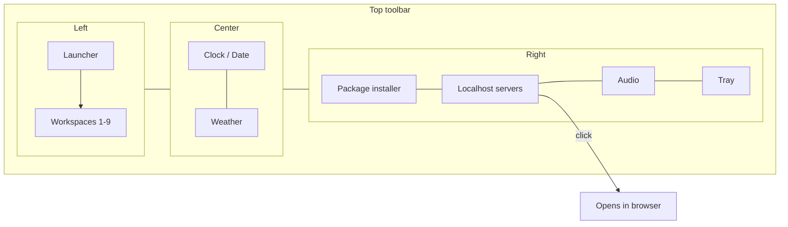
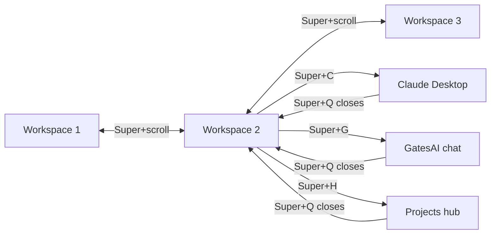

# hypr-ai-cockpit

A Hyprland desktop built as an **AI development cockpit** — a top toolbar
with a package installer and a live localhost indicator, Super-key chord
modes, a projects hub, and first-class setup for Claude Desktop, Codex
Desktop, and Cursor.

## Features

- **Top toolbar** (Waybar): time/date/weather/audio, a package-installer
  widget, and a top-right indicator of actively running localhost servers —
  click one to open it in your browser.
- **Super-key workflow**: a memorable chord scheme (`Super+C` Claude,
  `Super+G` GatesAI, `Super+H` Projects Hub, …), a searchable cheat sheet,
  and **Super+scroll** to slide between workspaces.
- **Projects hub**: register your own projects and jump straight into them.
- **AI tooling**: guided install for Claude Desktop, Codex Desktop, Cursor,
  and remote desktop access; GatesAI install + shortcut hookup.
- **Optional finance module**: ships disabled; bring your own data.

## Toolbar layout



## Workspace flow



## Install

Target platform: Arch/CachyOS with Hyprland.

```sh
git clone https://github.com/Calculator5329/hypr-ai-cockpit.git
cd hypr-ai-cockpit
./install.sh --dry-run   # preview what would change
./install.sh             # backup existing configs, then link these in
```

`install.sh` backs up anything it would replace to
`~/.config-backup-<timestamp>/` and can install the required packages
(pacman + AUR helper) from `packages/`.

## Documentation

| Doc | What it covers |
| --- | --- |
| [docs/keybinds.md](docs/keybinds.md) | Super-key cheat sheet + full keybind reference |
| [docs/toolbar.md](docs/toolbar.md) | Every toolbar module; enabling/disabling them |
| [docs/devices.md](docs/devices.md) | Auto-connecting your default devices on login |
| [docs/ai-tools.md](docs/ai-tools.md) | Claude Desktop, Codex Desktop, Cursor, remote desktop |
| [docs/gatesai.md](docs/gatesai.md) | Installing GatesAI and wiring its Super-key shortcut |
| [docs/projects-hub.md](docs/projects-hub.md) | Registering your own projects and jumping between them |
| [docs/finance-optional.md](docs/finance-optional.md) | Enabling the optional finance bar module with your own data |
| [docs/scrub-checklist.md](docs/scrub-checklist.md) | Contributor checklist: keep personal data out |

## Verifying a checkout

```sh
bash tests/verify.sh
```

Lints the install script and scans the tree for anything that looks like
personal data or credentials — it must pass before any release.

## License

MIT — see [LICENSE](LICENSE).

> Status: prepared for public release; visibility flip pending owner review.
